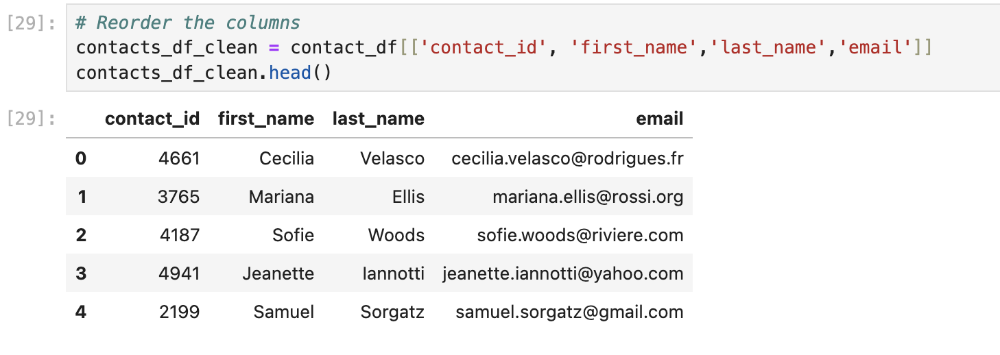

# Crowdfunding-ETL

CREATING THE DATAFRAMES

We created the category and subcategory dataframes by first loading in the crowdingfunding data and saving it as a dataframe. From there we split the 'category & subcategory column' into 2 separate columns, one that held the category data and the other that held the subcategory data. We then saved the data from the category and subcategory series' as lists, and created two lists that held numbers for each item in the category and subcategory series. Finaly we turned the data with their respective numbered lists into dataframes, and saved the data as csv files. 

We created the campaign dataframe by first copying the original dataframe that held the data from the crowdfunding excel file. From there we saved only the columns that we wanted, merged the information from the category and subcategory dataframes, and changed the dates to datetime format. 

For the contacts dataframe we loaded the contacts excel file and saved it as a dataframe. From there we saved the data as a list of lists that held the individual values, and turned that to a dataframe. Finally we created new columns for the first and last name and reordered the columns, 

CREATING THE ERD

Using https://app.quickdatabasediagrams.com/#/ we listed the columns from the dataframes as our variables in the tables. We made the Primary keys to be contact_id in contacts, category_id in categories, subcategory_id in subcategories, and cf_id in campaigns. 

QUERYING THE TABLES

After exporting the schema from quickdatabasediagrams, we copy and pasted the schema into a new database to create our tables. From there we loaded the data from our csv's into the tables. To create the tables in the correct order, run categories first, then subcategories, then contacts, and finally campaign. Load the data into the tables following the same order to avoid error. After running your tables should look like this:

 
